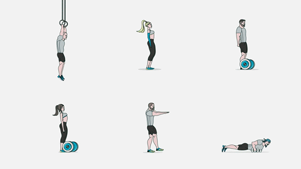
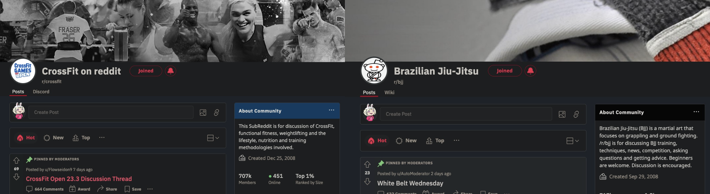
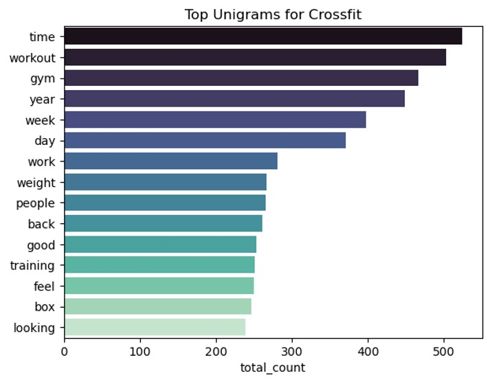
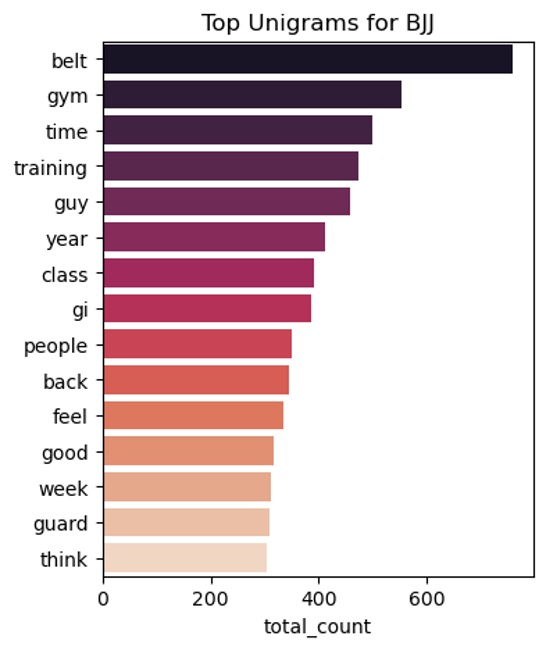
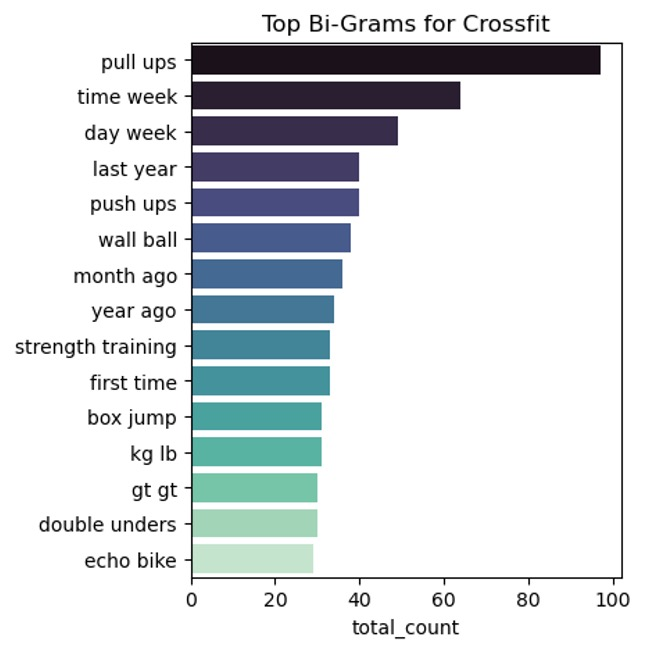
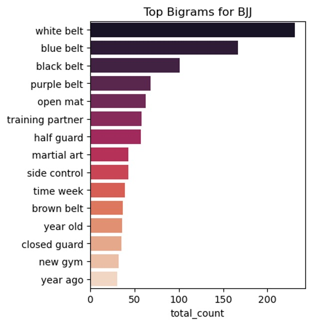
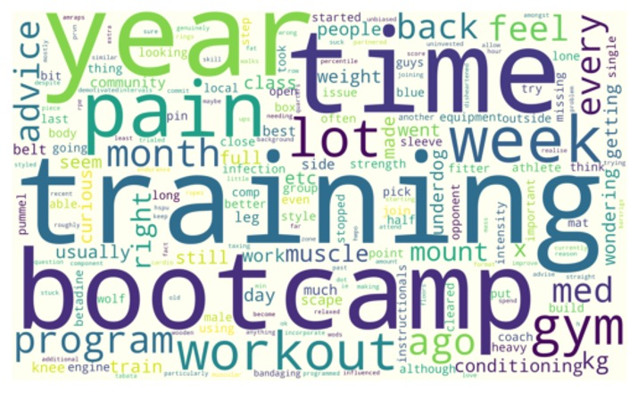
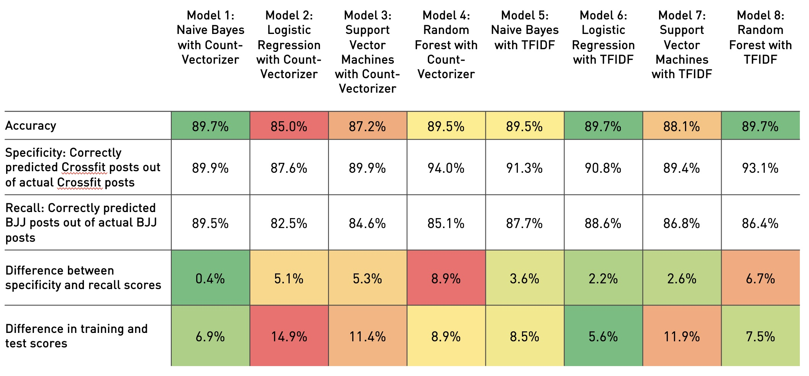

<h1 align="center"> Building a Text Classification Tool with Natural Language Processing to Categorise Crossfit and Brazilian Jiu-jitsu Posts </h1>
<h4 align="center"> DSIF 9 Project 3 </h4>  

 

 

## Table of Contents

- [Problem Statement](#problem-statement)
- [Approach](#approach)
- [Data Collection](#data-collection)
- [Preprocessing](#preprocessing)
- [Exploratory Data Analysis](#exploratory-data-analysis)
- [Modelling and Evaluation](#modelling)
- [Conclusion and Recommendations](#conclusion)

## Problem Statement

Mixed martial arts gym GrappleBox is known for for offering a unique proposition of Crossfit and Brazilian Jujitsu (BJJ). It has a website with an open forum which had generated robust discussion from practitioners of both sports during the Covid-19 lockdown periods. 

When the gym first started, forum discussions were not segregated by sport. Three years on, the forum has evolved to become a disorganized repository of threads and comments.

The gym owners would like to revamp the forum page but retain existing discussion threads. They approached our data science team to build a tool that could automatically filter for a particular forum thread or comment relates to Crossfit and BJJ, so that they can revamp the forum webpage and improve the user experience for their customers. 

Success is determined by the accuracy of the automatic filtering tool and its ability to classify both topics equally well. The gym owners would be more than happy to pay for a first cut of the model and a presentation to their team. Secondary success metrics would be increased customer satisfaction for Grapplebox’s members, which hopefully translates to higher customer loyalty and acquisition. 

## Approach

The data analytics team hopes to develop a model that maximises the number of correct predictions for both categories with minimal mistakes, taking the following approach:

- Obtain data from online forums discussing the same topics of interest. 
- Clean and process the data through a series of steps in preparation for modeling. Details of each cleaning step will be in the code itself.
- Perform exploratory data analysis to understand the underlying trends.
- Experiment with different models and hyperparameters to see which model produces the best results.
- Use the best model to predict on the holdout set to see how it performs on unseen data.
- Present the model and approach to stakeholders.

## Data Collection

 

To simulate a dataset that is similar and relevant to the content generated by the gym's clientele on their website's forum, two sub-reddits [r/crossfit](https://www.reddit.com/r/crossfit/) and [r/bjj](https://www.reddit.com/r/bjj/) were scraped using the PushShift API. After cleaning and de-duplication, 1482 unique posts were obtained from r/crossfit and 1630 from r/bjj.

## Preprocessing

The steps taken to prepare the data for modelling included:

1) Removing duplicated posts, which appeared in the initial collection of scraped data
2) Removing posts that comprised of no text, or had been censored by reddit moderators (e.g. containing only the text '[removed]')
3) Conducting exploratory data analysis through histograms of word counts and word clouds to see the most common unigrams ans bigrams that occur in the corpus
4) Converting contracted language into their longer form (“I’m” to “I am”)
5) Lowercasing all words
6) Removing keywords that are directly related to the subreddit topic so as to create a more robust classifier. Words excluded included crossfit, bjj, Brazilian, jiu jitsu. Permutations were addressed using regex to avoid removing unintended characters from other words.
7) Removed commonly used words aka stopwords using with custom extensions to NLTK’s stopword list 
8) Replaced emojis with literal descriptions of what they are. Emojis were retained because they add emotional flavour to the intent of a particular sentence or post.
9) Lemmatization to reduce words to their core form and remove punctuation
10) Also removed were words comprising only of digits, and words longer than 30 characters, which are likely to be gibberish, as well as other keywords that do not add additional value but are common in forums requesting for 
11) We only retained posts with more than 5 words because the model is not likely to pick up meaning from posts without sufficient information. Posts with few words are likely to be accompanied with a video, photo or gif that was not scraped for our project. 

## Exploratory Data Analysis

To get a sense of the dataset, we visualised the top occuring words by class:

 

The list of associated words for both sub-reddits was not too different for unigrams, but the top bigrams were much more interesting, with clearly distinguished phrases:

 

Word clouds were created as a quick way to see the most commonly occurring unigrams to get a broad understanding of what main themes are:

A quick topic modelling attempt using Latent Dirichlet Allocation (LDA) and Word2Vec uncovered themes among clusters of words within each sub-reddit. Detailed results can be found in the code.

## Modelling and Evaluation 

- The models used and their results are summarised below:

The best performing model for our use case was Model 6, Logistic Regression with TFIDF that fulfilled our business needs:

1) High accuracy rate of 89.7%
2) Balanced specificity and recall scores that differ by only 2.2%
3) Smallest degree of overfitting, so most likely to generalise well. This is very important for applying the model to the gym's data.

    

    
## Conclusion and Recommendations

The gym can make use of Model 6 to classify existing and new forum threads on its website, with the expectation that the posts will be classified correctly 90% of the time, at minimal cost. On the revamped website, the gym's clients can then enjoy a cleaner interface with forum posts divided by sport. 
    
To improve the model and reduce the error rate, the gym may want to consider these next steps:

- Let the model train on a larger dataset and include Singlish vocabulary which will be different from international Reddit content that the original model was trained on, so that it can pick up on locale-specific nuances.
- Review the posts that were erroneously classified to see what keywords might be appearing and tweaking the model hyperparameters further.
- Conduct detailed topic modelling to identify the main keywords most associated with each sport, which could be used to classify the forum posts at the point of creation.
- Consider more advanced models such as recurrent neural networks for classifying texts. 
- Use libraries with pre-built NLP preprocessing pipelines and models to prep and train the data more efficiently, customising the pipelines according to the use case. Examples include spaCy and textblob.
